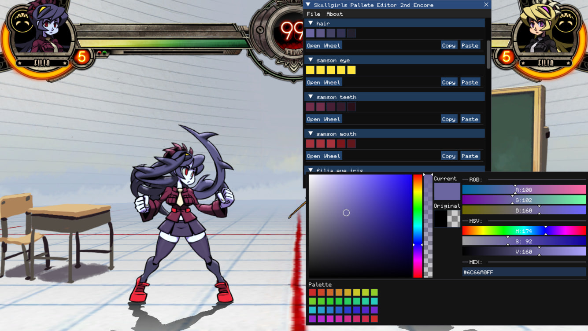

# Palette Editor for Skullgirls 2nd Encore

The palette editor for Skullgirls 2nd Encore is a specialized tool for creating, editing, and automatically uploading custom character color palettes. Change colors instantly, save your palettes, and share them with the community.

# install .exe version (v0.5)
- Download the executable file from [GitHub](https://github.com/Skullgirls-Communitys-Cut/SkullGirls-Pallete-Editor-2nd-Encore-_Cplusplus-Version_/releases/tag/v0.5).
- Launch the game
- Launch the editor

We recommend placing the executable (EXE) outside the game's folder, as the editor currently conflicts with CoreMessaging.dll ([SkullLoader](https://github.com/Skullgirls-Communitys-Cut/SkullLoader)).

# install the .dll version (v0.6)
- Download the .dll from [GitHub](https://github.com/Skullgirls-Communitys-Cut/SkullGirls-Pallete-Editor-2nd-Encore-_Cplusplus-Version_/releases/tag/v0.6).
- Place d3d9.dll in the game folder (so that the d3d9.dll is located next to Skullgirls.exe!)
- Launch the game

To hide or show the editor window, press the `INSERT` key.  
In this version palettes work **online**.
